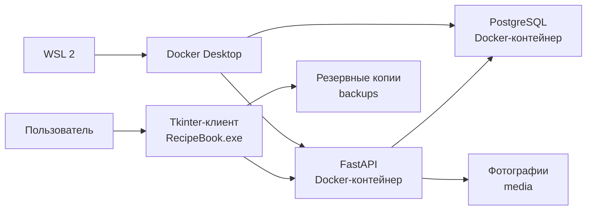

# Книга рецептов

Десктопное приложение для Windows 10/11, предназначенное для поиска, просмотра и редактирования кулинарных рецептов.

Приложение поддерживает поиск по названию, категориям и ингредиентам, фильтрацию аллергенов, пересчёт порций, административное редактирование и резервное копирование PostgreSQL вместе с фотографиями блюд.

Текущая версия: `1.0.0`

## Содержание

- [Возможности](#возможности)
- [Архитектура](#архитектура)
- [Используемые технологии](#используемые-технологии)
- [Системные требования](#системные-требования)
- [Docker Desktop и WSL](#docker-desktop-и-wsl)
- [Установка](#установка)
- [Первый запуск](#первый-запуск)
- [Обычный запуск](#обычный-запуск)
- [Работа с приложением](#работа-с-приложением)
- [Резервное копирование](#резервное-копирование)
- [Структура базы данных](#структура-базы-данных)
- [Структура проекта](#структура-проекта)
- [Удаление](#удаление)
- [Возможные проблемы](#возможные-проблемы)
- [Рекомендации по безопасности](#рекомендации-по-безопасности)

## Возможности

### Поиск рецептов

Поддерживается поиск:

- по полному или частичному названию;
- по ингредиентам;
- по категории блюда.

### Фильтрация

Доступны фильтры:

- по одной или нескольким категориям;
- по обязательным ингредиентам;
- по отсутствующим ингредиентам;
- по максимальному времени приготовления;
- по максимальной калорийности;
- по распространённым аллергенам.

Для выбранных ингредиентов предусмотрены режимы:

- должны присутствовать все ингредиенты;
- достаточно присутствия одного ингредиента.

### Карточка рецепта

Карточка содержит:

- название блюда;
- категории;
- фотографию;
- исходное количество порций;
- время приготовления;
- калорийность одной порции;
- ингредиенты;
- количество каждого ингредиента;
- единицы измерения;
- последовательные этапы приготовления.

Фотография отображается полностью с сохранением пропорций.

### Калькулятор порций

Калькулятор пересчитывает:

- количество ингредиентов;
- массу и объём продуктов;
- штучные значения;
- общую калорийность.

Коэффициент пересчёта определяется как отношение требуемого количества порций к исходному.

### Административное управление

В разделе «Управление» доступны:

- добавление рецептов;
- изменение рецептов;
- удаление рецептов;
- загрузка фотографий;
- управление категориями;
- управление ингредиентами;
- создание резервных копий;
- восстановление выбранного бэкапа;
- удаление пользовательских бэкапов.

Стартовая резервная копия защищена от удаления через приложение.

## Архитектура



Приложение состоит из трёх основных компонентов:

1. Tkinter-клиент для Windows.
2. FastAPI для обработки запросов.
3. PostgreSQL для хранения данных.

Tkinter-клиент взаимодействует с FastAPI через локальные HTTP-запросы. FastAPI работает с PostgreSQL через SQLAlchemy.

## Используемые технологии

### Клиент

- Python;
- Tkinter;
- Requests;
- Pillow;
- PyInstaller.

### Сервер

- FastAPI;
- Uvicorn;
- SQLAlchemy;
- Pydantic;
- Alembic.

### Хранение данных

- PostgreSQL;
- файловая система для фотографий;
- `pg_dump` и `pg_restore` для бэкапов.

### Развёртывание

- Docker Desktop;
- Docker Compose;
- WSL 2;
- Inno Setup;
- PowerShell.

## Системные требования

Рекомендуемая конфигурация:

- Windows 10/11 x64;
- актуальные обновления Windows;
- не менее 8 ГБ оперативной памяти;
- не менее 10 ГБ свободного пространства;
- процессор с аппаратной виртуализацией;
- доступ к интернету во время первоначальной установки;
- учётная запись с правами администратора.

Аппаратная виртуализация может называться:

- Intel Virtualization Technology;
- Intel VT-x;
- AMD-V;
- SVM Mode.

## Docker Desktop и WSL

Docker Desktop и WSL 2 являются обязательными компонентами.

Установщик приложения помогает установить их, однако пользователь должен понимать, что без них серверная часть работать не будет.

### WSL 2

WSL 2 предоставляет Linux-среду, необходимую Docker Desktop для запуска контейнеров.

После установки WSL может потребоваться перезагрузка Windows. Если система предлагает перезагрузку, её необходимо выполнить.

### Docker Desktop

Docker Desktop запускает:

- контейнер PostgreSQL;
- контейнер FastAPI;
- внутреннюю сеть приложения;
- постоянное хранилище базы данных.

Файл `RecipeBook.exe` является графическим клиентом. Без работающего Docker Desktop приложение не сможет получать и сохранять рецепты.

Не следует:

- удалять Docker Desktop;
- отключать WSL;
- вручную удалять контейнеры;
- удалять Docker volumes;
- закрывать Docker во время восстановления бэкапа.

Docker Desktop регулируется отдельными [лицензионными условиями](https://www.docker.com/legal/docker-subscription-service-agreement/).

## Установка

### 1. Подготовка

Перед установкой:

1. Подключите компьютер к интернету.
2. Убедитесь, что Windows обновлена.
3. Проверьте наличие свободного пространства.
4. Убедитесь, что виртуализация включена.
5. Подготовьтесь подтвердить запрос администратора.

### 2. Запуск установщика

Запустите файл:

```text
RecipeBookSetup-1.0.0.exe
```

Установщик необходимо запускать от имени администратора:

1. Нажмите на файл правой кнопкой мыши.
2. Выберите «Запуск от имени администратора».
3. Подтвердите запрос контроля учётных записей Windows.

> Приложение также рекомендуется всегда запускать от имени администратора. Это особенно важно для работы с Docker, восстановления PostgreSQL, фотографиями и резервными копиями.

### 3. Установка компонентов

В процессе могут устанавливаться:

- WSL 2;
- Docker Desktop;
- серверная часть приложения;
- PostgreSQL;
- файлы графического клиента.

Не отменяйте установку Docker или WSL. Без них приложение не будет работать полноценно.

### 4. Принятие условий Docker

При установке Docker Desktop пользователь должен:

1. Увидеть уведомление об установке дополнительного компонента.
2. Ознакомиться с условиями Docker.
3. Подтвердить установку.
4. Принять Docker Subscription Service Agreement.

### 5. Ожидание

Во время установки:

- не закрывайте установщик;
- не выключайте компьютер;
- не отключайте интернет;
- не запускайте установщик повторно;
- не завершайте процессы Docker.

### 6. Перезагрузка

Если WSL, Docker Desktop или Windows запросит перезагрузку, выполните её.

Без перезагрузки компоненты виртуализации могут оставаться в незавершённом состоянии.

## Первый запуск

После установки на рабочем столе должен появиться ярлык «Книга рецептов».

### Порядок запуска

1. Нажмите ярлык правой кнопкой мыши.
2. Выберите «Запуск от имени администратора».
3. Подтвердите запрос Windows.
4. Дождитесь запуска Docker Desktop.
5. Дождитесь подготовки контейнеров.
6. На стартовой странице нажмите «Начать».
7. Перейдите в раздел «Управление», откройте подраздел «Резервные копии», выберите «Стартовая база рецептов» и нажмите «Переключиться на выбранный».
8. В течение минуты дождитесь информационного окна об успешном переключении на выбранный бэкап.

При первом запуске приложение:

- запускает Docker Desktop;
- ожидает готовности Docker Engine;
- запускает PostgreSQL;
- запускает FastAPI;
- выполняет миграции;
- проверяет подключение к базе;
- открывает Tkinter-клиент.

Первый запуск может занять несколько минут. Не нажимайте ярлык несколько раз подряд.

## Обычный запуск

При последующих запусках:

1. Полностью закройте ненужные окна Проводника Windows.
2. Нажмите правой кнопкой мыши на ярлык.
3. Выберите «Запуск от имени администратора».
4. Дождитесь запуска Docker.
5. Нажмите «Начать».

Значок Docker может отображаться в области уведомлений Windows. Это нормальное поведение.

## Работа с приложением

### Поиск

1. Введите название рецепта или ингредиента.
2. Выберите категории.
3. Настройте дополнительные фильтры.
4. Нажмите «Найти».
5. Выберите рецепт.
6. Нажмите «Открыть рецепт».

### Калькулятор

1. Откройте карточку рецепта.
2. Укажите требуемое количество порций.
3. Нажмите «Пересчитать».
4. Проверьте ингредиенты и общую калорийность.

### Управление рецептами

1. Запустите приложение от имени администратора.
2. Нажмите «Управление».
3. Перейдите во вкладку рецептов.
4. Выберите добавление, изменение или удаление.
5. Заполните данные.
6. Сохраните изменения.

## Резервное копирование

### Обязательное требование к Проводнику Windows

Перед созданием, удалением, восстановлением или переключением бэкапа необходимо полностью закрыть все окна Проводника Windows.

Особенно важно закрыть окна, в которых открыты:

- каталог приложения;
- папка `backups`;
- папка `media`;
- папка с фотографиями;
- каталог выбранной резервной копии.

Проводник может удерживать файлы или каталоги открытыми. Это способно помешать:

- переименованию папки `media`;
- замене изображений;
- созданию архива;
- удалению бэкапа;
- восстановлению файлов;
- сохранению нового бэкапа.

Под «полностью закрыть Проводник» подразумевается закрыть все его окна. Принудительно завершать системный процесс `explorer.exe` не требуется.

### Создание нового бэкапа

Перед внесением важных изменений:

1. Закройте все окна Проводника Windows.
2. Закройте приложение, если оно было запущено без прав администратора.
3. Запустите приложение от имени администратора.
4. Откройте «Управление».
5. Перейдите во вкладку резервных копий.
6. Нажмите «Создать новый бэкап».
7. Укажите понятное название.
8. Дождитесь завершения.
9. Убедитесь, что новый бэкап появился в списке.
10. Только после этого приступайте к изменениям.

### Переключение на другой бэкап

1. Закройте все окна Проводника Windows.
2. Запустите приложение от имени администратора.
3. Откройте «Управление».
4. Перейдите во вкладку бэкапов.
5. Выберите нужную копию.
6. Нажмите «Переключиться на выбранный».
7. Подтвердите восстановление.
8. Дождитесь завершения.
9. Не закрывайте Docker и приложение во время операции.

> Перед переключением автоматический бэкап текущего состояния не создаётся. При необходимости сохраните его вручную.

### Удаление бэкапа

1. Закройте все окна Проводника.
2. Запустите приложение от имени администратора.
3. Выберите пользовательский бэкап.
4. Нажмите красную кнопку «Удалить».
5. Подтвердите действие.

Стартовую базу рецептов удалить через приложение нельзя.

### Состав резервной копии

Полная резервная копия может включать:

- дамп PostgreSQL;
- архив фотографий;
- манифест;
- описание;
- дату создания;
- контрольные суммы.

Каталог определяется относительно установленного приложения:

```text
<каталог приложения>\backups
```

## Структура базы данных

Приложение использует пять основных таблиц.

### `recipes`

Содержит:

- название;
- фотографию;
- количество порций;
- ингредиенты и количества;
- единицы измерения;
- этапы приготовления;
- время;
- калорийность.

### `categories`

Справочник категорий блюд.

### `ingredients`

Справочник ингредиентов.

### `recipe_categories`

Связь рецептов и категорий.

### `recipe_ingredients`

Связь рецептов и ингредиентов, используемая для поиска и фильтрации.

Alembic также может создавать отдельную техническую таблицу версии миграции.

## Структура проекта

```text
recipe-book
├── backend
│   ├── app
│   │   ├── routers
│   │   │   ├── categories.py
│   │   │   ├── ingredients.py
│   │   │   └── recipes.py
│   │   ├── schemas
│   │   │   ├── category.py
│   │   │   ├── ingredient.py
│   │   │   └── recipe.py
│   │   ├── services
│   │   │   └── image_service.py
│   │   ├── config.py
│   │   ├── database.py
│   │   ├── main.py
│   │   └── models.py
│   └── migrations
│       ├── versions
│       │   ├── 5143e3c1c147_add_recipe_search_indexes.py
│       │   └── 5aaa8eb444e2_create_recipe_database_structure.py
│       ├── env.py
│       └── script.py.mako
├── backups
│   └── initial
│       ├── backup-info.json
│       ├── checksums.json
│       ├── media.zip
│       └── recipe_book.dump
├── desktop
│   ├── assets
│   │   ├── Main.jpg
│   │   └── RecipeBook.ico
│   ├── admin_window.py
│   ├── api_client.py
│   ├── backup_manager.py
│   ├── backup_tab.py
│   ├── main.py
│   ├── paths.py
│   ├── recipe_details.py
│   ├── recipe_editor.py
│   ├── start_page.py
│   └── theme.py
├── installer
│   ├── prerequisites
│   │   ├── Docker Desktop Installer.exe
│   │   ├── InstallPrerequisites.ps1
│   │   └── wsl-x64.msi
│   └── RecipeBookSetup.iss
├── installer-output
│   └── RecipeBookSetup-1.0.0.exe
├── media
│   ├── images
│   └── recipes
├── release
│   ├── backend
│   ├── backups
│   ├── media
│   ├── scripts
│   ├── Dockerfile
│   ├── RecipeBook.exe
│   ├── RecipeBookLauncher.exe
│   ├── Start.bat
│   ├── alembic.ini
│   ├── compose.yaml
│   └── requirements.txt
├── scripts
│   ├── backup.ps1
│   ├── create_icon.py
│   └── restore.ps1
├── build
├── dist
│   ├── RecipeBook.exe
│   └── RecipeBookLauncher.exe
├── .env
├── .gitignore
├── README.md
├── RecipeBook.exe
├── RecipeBook.spec
├── RecipeBookLauncher.exe
├── RecipeBookLauncher.spec
├── Start.bat
├── alembic.ini
├── compose.yaml
├── Dockerfile
├── launcher.py
├── requirements-dev.txt
├── requirements.txt
└── .venv
```

## Удаление

Перед удалением:

1. Закройте Проводник Windows.
2. Запустите приложение от имени администратора.
3. Создайте последний бэкап.
4. Скопируйте важные копии в безопасное место.
5. Закройте приложение.
6. Удалите его через параметры Windows.

Docker Desktop и WSL не следует автоматически удалять вместе с приложением: они могут использоваться другими программами.

Удаление Docker volumes может безвозвратно уничтожить базу рецептов.

## Возможные проблемы

### Приложение долго запускается

Возможные причины:

- запускается Docker Desktop;
- создаются контейнеры;
- готовится PostgreSQL;
- применяются миграции;
- проверяется API.

Подождите несколько минут и не запускайте приложение повторно.

### Рецепты не загружаются

Проверьте:

- выполнена ли перезагрузка после установки WSL;
- работает ли Docker Desktop;
- приложение запущено от имени администратора;
- не блокируется ли локальное соединение;
- завершилась ли первоначальная подготовка.

### Ошибка при создании бэкапа

Проверьте:

- закрыты ли все окна Проводника Windows;
- запущено ли приложение от имени администратора;
- работает ли Docker Desktop;
- хватает ли свободного пространства;
- не открыт ли каталог бэкапа другой программой.

### Ошибка восстановления

Не закрывайте приложение и Docker во время восстановления. Перед повторной попыткой:

1. Закройте все окна Проводника.
2. Перезапустите приложение от имени администратора.
3. Проверьте наличие всех файлов бэкапа.
4. Повторите восстановление.

### Не отображаются фотографии

Возможные причины:

- удалена папка `media`;
- восстановлен только дамп базы;
- отсутствует архив фотографий;
- фотографии были перемещены вручную.

## Рекомендации по безопасности

- Всегда запускайте приложение от имени администратора.
- Не публикуйте PostgreSQL во внешнюю сеть.
- Не открывайте API в интернет без дополнительной защиты.
- Не удаляйте Docker volumes вручную.
- Регулярно создавайте резервные копии.
- Храните хотя бы один бэкап вне каталога приложения.
- Не изменяйте файлы внутри активного бэкапа.
- Не закрывайте Docker во время операций с данными.
- Перед изменением или восстановлением полностью закрывайте Проводник Windows.
- Используйте установщик только из доверенного источника.

## Текущие ограничения

- Для работы требуются Docker Desktop и WSL 2.
- Может потребоваться перезагрузка Windows.
- Первый запуск может занимать несколько минут.
- Автоматический бэкап перед переключением не создаётся.
- Стартовая копия защищена только через интерфейс приложения.
- Ручное удаление файлов может обойти защиту.
- Отдельная трёхсценарная логика Docker/WSL не реализована.
- Для надёжной работы с бэкапами требуются права администратора и закрытые окна Проводника Windows.
